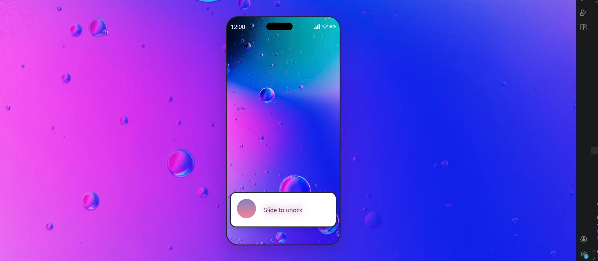
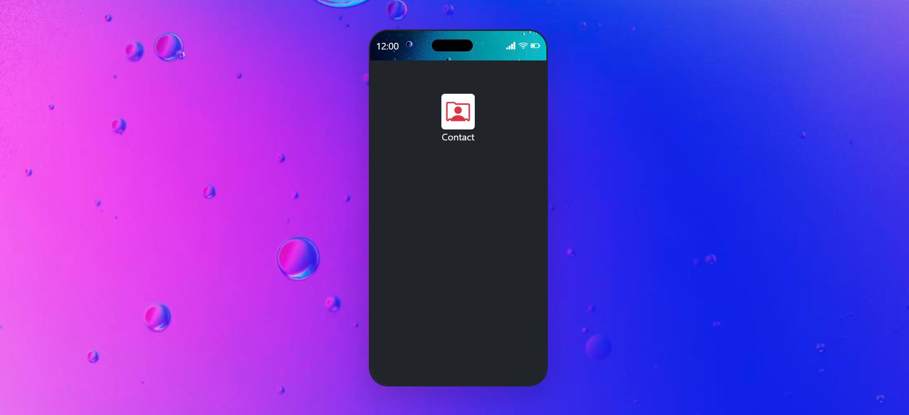
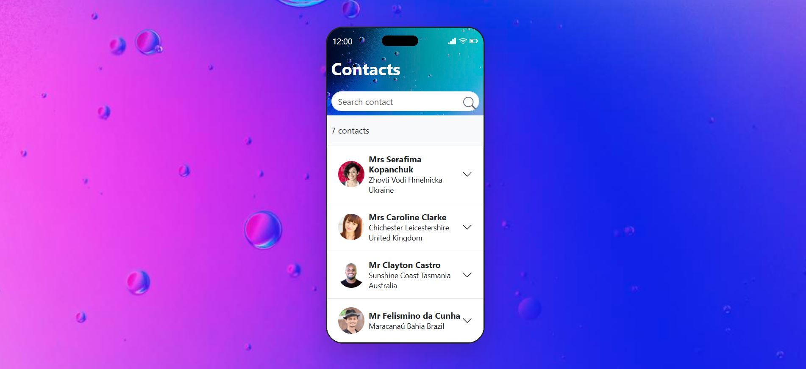

# Contact App

A mobile-styled contact list application that simulates a phone unlock experience and displays randomly fetched user contacts with full details.

---

## Screenshots





## Features

- **Slide to unlock** — interactive slider to transition from home screen to app screen
- **Random contacts** — fetches 7 random users from the Random User API on load
- **Live search** — filter contacts by name in real time
- **Accordion list** — click any contact to expand and see full details
- **Tap to call** — clickable phone number
- **Tap to email** — clickable email address
- **Google Maps link** — clickable address opens location in Google Maps
- **Loading spinner** — shown while contacts are being fetched

---

## Tech Stack

- **Vanilla JavaScript** — no frameworks
- **Bootstrap 5** — accordion, layout & utilities
- **Bootstrap Icons** — phone, email, location icons
- **Random User API** — generates random contact data

---

## API Used

```
https://randomuser.me/api?results=7
```

Returns 7 randomly generated users with name, photo, phone, email and address. Completely free, no API key required.

---

## Folder Structure

```
contact-app/
├── index.html
├── app.js
├── style.css
└── README.md
```

---

## Setup & Installation

**1. Clone the repo:**

```bash
git clone https://github.com/yourusername/contact-app.git
cd contact-app
```

**2. Open in browser:**

```bash
# Just open index.html in your browser
# No install or build step needed!
```

---

## Usage

1. **Home screen** — slide the slider past 80% to unlock
2. **App screen** — click the contacts button to load contacts
3. **Contact screen** — browse the list, click any contact to expand
4. **Search** — type in the search bar to filter by name in real time

---

## 👨Author

**Brazesh Guragain**

© 2026 Contact App. All rights reserved.
